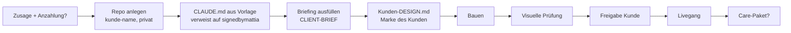

# Neues Kundenrepo anlegen

Stand: 24.09.2026 · Status: **Entwurf** · Entscheid: pro Kundenwebsite ein
eigenes Repo.

## Name

`kunde-<kurzname>`, klein, Bindestriche, ohne Umlaute, z. B. `kunde-muster-sanitaer`.
Privat.

## Ablauf

1. **Anlegen:** Mattia erstellt das Repo leer auf GitHub (Claude kann keine
   Repos erstellen).
2. **CLAUDE.md** des Kundenrepos: Kundenregeln und ein Verweis auf
   `signedbymattia/marke/ui-regeln.md`, `grundlagen/angebote-preise.md`
   (Umfang des gekauften Pakets) und `vorlagen/`.
3. **Kundendaten** (Kontakte, Inhalte, Zugänge) nur im Kundenrepo bzw. im
   Passwortmanager, nie hier und nie im Vault.
4. **Kunden-`DESIGN.md`**: die Marke des Kunden, nicht die von signedbymattia.
5. **Stunden mitschreiben** (Zielplan: Aufwand pro Projekt ist die wichtigste
   Zahl).
6. **Fusslink** „Website: signedbymattia“ nur mit Zustimmung des Kunden.

## Offen [?]

- Anzahlung ja/nein, wie viel?
- Wer besitzt Domain und Hosting: Kunde oder Agency?
- Wird die Probewebsite aus dem Lead Bot zum Startpunkt des Kundenrepos?
