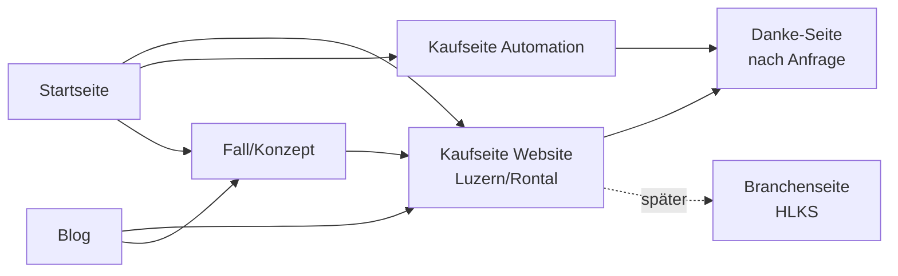

# Seitenstruktur der eigenen Website

Stand: 24.09.2026 · Status: **Entwurf** · Zielplan KW 41 („Seitenstruktur
festlegen: welche Seiten, in welcher Reihenfolge, ein Ziel pro Seite“) · gebaut
wird in `signedbymattia-website`

## Seiten in Bau-Reihenfolge [A] (Projektnotiz 23.09.2026 + Marketing 24.09.2026)

| Nr. | Seite | Ein Ziel | Beantwortet die Frage | Suchabsicht |
| --- | --- | --- | --- | --- |
| 1 | Startseite | zur passenden Kaufseite führen | „Bin ich hier richtig?“ | Marke |
| 2 | Kaufseite Website | Anfrage | „Was kostet es, wie läuft es, kann er das?“ | „webdesign luzern“, „website erstellen lassen“ |
| 3 | Kaufseite Automation | Anfrage | „Welcher Ablauf, was bringt es?“ | kleine Automationen |
| 4 | Fall/Konzept | Vertrauen → Kaufseite | „Wie denkt er, was hat er gemacht?“ | – |
| 5 | Danke-Seite | Tracking, nächster Schritt | „Was passiert jetzt?“ | – |
| 6 | Blog | Vertrauen, SEO, LinkedIn | echte Fragen kleiner Betriebe | Informationssuche |
| später | Branchenseite HLKS | Anfrage | „Kennt er meine Branche?“ | „website sanitär/heizung“ (Lücke) |
| Pflicht | Impressum, Datenschutz | Recht | – | – |

**Nicht:** fast gleiche Ortsseiten für Luzern, Ebikon, Root, Zug.

## Pflichtelemente der Kaufseite Website [F] (Marketing 24.09.2026)

1. Überschrift wiederholt die Suche.
2. Für wen und was danach besser ist, ein Satz.
3. Preisrahmen sichtbar, mit Grenzen.
4. Ein ehrlich gekennzeichneter visueller Beweis.
5. Ablauf in drei Schritten.
6. Kurzes Formular: Name, E-Mail, Firma/Website, Branche, Budgetrahmen, Freitext.
7. Häufige Fragen.
8. Wer dahinter steht, echte Kontaktadresse (sobald vorhanden).

## Offen [?]

- Domain und Hosting (Zielplan KW 42).
- Kommt eine Branchenseite HLKS schon zum Start oder später?
- Startseitentext (KW 41) schreibst du selbst, ganz, nicht stichwortartig.
