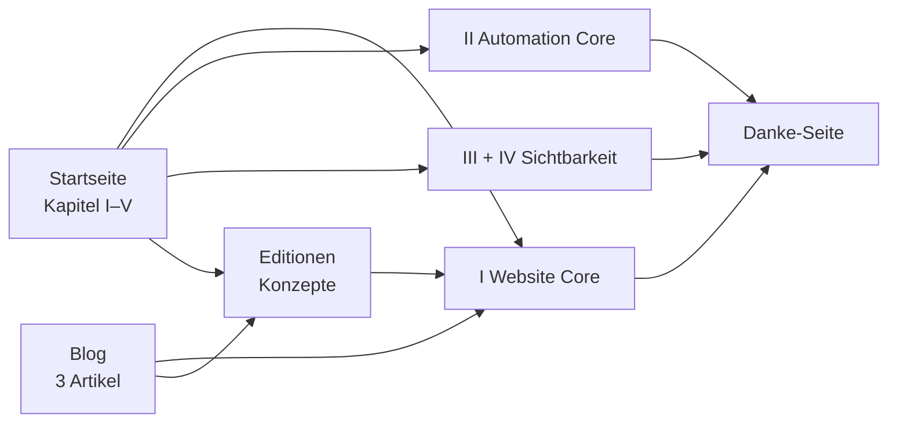

# Seitenstruktur der eigenen Website

Stand: 27.09.2026 · Status: **entschieden [F]** (Interview 27.09.2026, baut auf
der Identität „Edition“ auf) · Zielplan KW 41 („Seitenstruktur festlegen: welche
Seiten, in welcher Reihenfolge, ein Ziel pro Seite“) · gebaut wird in
`signedbymattia-website`

## Seiten zum Livegang am 22.11.2026 [F]

```mermaid
flowchart LR
    S[Startseite<br/>Kapitel I–V] --> K1[I Website Core]
    S --> K2[II Automation Core]
    S --> K3[III + IV Sichtbarkeit]
    S --> E[Editionen<br/>Konzepte]
    E --> K1
    B[Blog<br/>3 Artikel] --> K1
    B --> E
    K1 --> D[Danke-Seite]
    K2 --> D
    K3 --> D
```

| Nr. | Seite | Ein Ziel | Beantwortet die Frage | Suchabsicht |
| --- | --- | --- | --- | --- |
| 1 | **Startseite** | zur passenden Kaufseite führen | „Bin ich hier richtig?“ | Marke |
| 2 | Kaufseite **I Website Core** (CHF 1'600, Ziel der Google-Anzeigen) | Anfrage | „Was kostet es, wie läuft es, kann er das?“ | „webdesign luzern“, „website erstellen lassen“ |
| 3 | Kaufseite **II Automation Core** | Anfrage | „Welcher Ablauf, was bringt es?“ | kleine Automationen |
| 4 | Kaufseite **III + IV Sichtbarkeit** (SEO + GEO + Google-Profil) | Anfrage | „Wie werde ich gefunden?“ | lokale Sichtbarkeit |
| 5 | **Editionen** (Galerie) | Vertrauen → Kaufseite | „Wie denkt er, was kann er?“ | – |
| 6 | **Blog** mit 3 Artikeln zum Start | Vertrauen, SEO, LinkedIn | echte Fragen kleiner Betriebe | Informationssuche |
| 7 | Danke-Seite | Tracking, nächster Schritt | „Was passiert jetzt?“ | – |
| Pflicht | Impressum, Datenschutz | Recht | – | – |
| später | Branchenseite HLKS | Anfrage | „Kennt er meine Branche?“ | „website sanitär/heizung“ (Lücke) |

- **SEO + GEO und Google-Profil auf einer Seite** [A]: weniger Text bis zum
  18.10., und die Themen gehören zusammen. Zwei Seiten, falls die
  Keyword-Recherche es nahelegt.
- **V Texte + Branding** hat keine eigene Kaufseite, nur ein Kapitel auf der
  Startseite.
- **HLKS-Branchenseite erst nach dem Livegang** (zum Start nicht gewählt).
- **Nicht:** fast gleiche Ortsseiten für Luzern, Ebikon, Root, Zug.

## Startseite: Aufbau wie Shopify Editions [F]

Vorbild: Shopify Editions (`marke/referenzen.md`), kombiniert mit den zwei
Wow-Akten aus `marke/DESIGN.md` §7.

1. **Hero:** „Gemalt in *Code*.“ im Barock-Himmel, daneben der **Kapitel-Index
   I–V** als fette Liste mit römischen Zahlen (Host Grotesk fett, Zahlen in
   Instrument Serif).
2. **Akt I, Himmel:** Scroll-Flug durch die Wolkenebenen.
3. **Akt II, Galerie:** Landung im 3D-Saal, die Editionen hängen als Gemälde.
4. **Kapitel I–V:** je ein kurzer Abschnitt pro Leistung, jeweils mit Link zur
   Kaufseite:

   | Kapitel | Leistung | führt zu |
   | --- | --- | --- |
   | I | Website Core | Kaufseite I |
   | II | Automation Core | Kaufseite II |
   | III | SEO + GEO | Kaufseite III + IV |
   | IV | Google-Profil | Kaufseite III + IV |
   | V | Texte + Branding | Anfrage |

5. **Abschluss:** „Kein Template. Ein *Werk*.“ und der Knopf „Edition anfragen“.

Jede Sektion beantwortet eine Frage des Besuchers (`marke/ui-regeln.md`,
Sektionsfrage).

## Editionen [F]

- Menüpunkt heisst **„Editionen“**.
- Zum Start hängen **2–3 Konzept-Editionen**: Probewebsites für echte Betriebe,
  **klar als „Konzept“ markiert** (`marke/tonalitaet.md`). Nummerierung
  z. B. „Edition *No.* 001 · Konzept“ [A: ob Konzepte eigene Nummern
  bekommen oder die Zählung erst mit dem ersten Kunden beginnt, noch offen].
- Jede Edition: Screenshot im Goldrahmen, Betrieb, Aufgabe, was entschieden
  wurde und warum (Positionierungssatz 4: „begründe jede Entscheidung“).

## Pflichtelemente jeder Kaufseite [F] (Marketing 24.09.2026)

1. Überschrift wiederholt die Suche.
2. Für wen und was danach besser ist, ein Satz.
3. Preisrahmen sichtbar, mit Grenzen.
4. Ein ehrlich gekennzeichneter visueller Beweis (Konzept-Edition).
5. Ablauf in drei Schritten.
6. Kurzes Formular: Name, E-Mail, Firma/Website, Branche, Budgetrahmen, Freitext.
7. Häufige Fragen.
8. Wer dahinter steht, echte Kontaktadresse (sobald vorhanden).

## Zeitplan der Texte

Meilenstein laut Zielplan: **18.10.2026, alle Texte stehen.** Das umfasst
Startseite, 3 Kaufseiten, Editionen und 3 Blogartikel.

**Warnung [A]:** grob 20–25 h Textarbeit in KW 40–42 (30 h verfügbar), dazu
Keywords, Hosting und Belege. Wird es eng, dürfen die 3 Blogartikel bis zum
Livegang am 22.11. fertig werden. Mattia hat am 27.09.2026 den Termin 18.10.
belassen.

## Offen [?]

- Domain und Hosting (Zielplan KW 42). Domain ist gesichert (`recht/pflichtangaben.md`).
- Startseitentext (KW 41) schreibt Mattia selbst, ganz, nicht stichwortartig.
- Welche Betriebe die 2–3 Konzept-Editionen zeigen.
- Themen der 3 Blogartikel.
